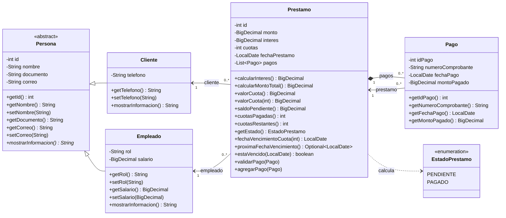
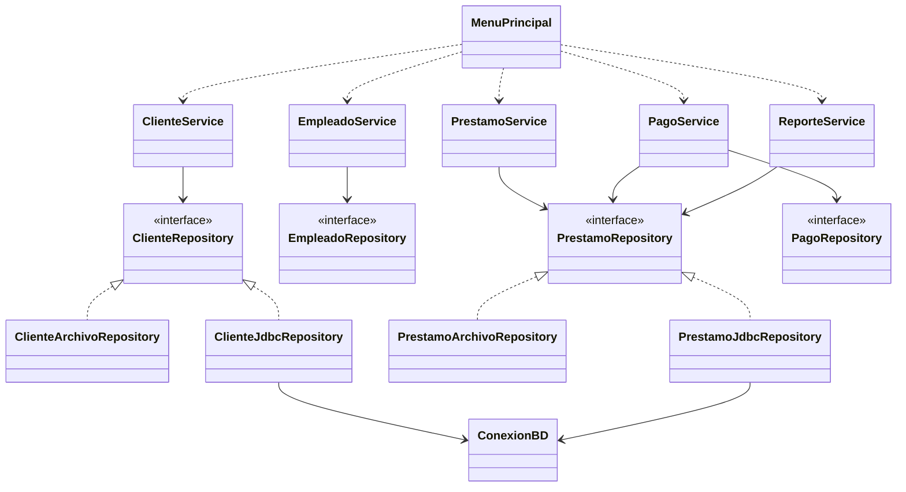

# Diagrama UML de clases - CrediYa S.A.S.

El diagrama está escrito en [Mermaid](https://mermaid.js.org/). GitHub lo dibuja automáticamente al abrir este archivo.
Para obtener una imagen (PNG/SVG) para la exposición: copia el bloque de código en <https://mermaid.live> y usa **Actions → PNG/SVG**.

## Modelo de dominio (las 5 clases pedidas + el enum de estado)

### Relaciones

| Relación | Significado |
|---|---|
| `Cliente` y `Empleado` heredan de `Persona` | Comparten id, nombre, documento y correo. `Persona` es abstracta. |
| `Cliente` 1 — N `Prestamo` | Un cliente puede tener muchos préstamos; cada préstamo pertenece a un cliente. |
| `Empleado` 1 — N `Prestamo` | Un empleado gestiona muchos préstamos; cada préstamo tiene un empleado. |
| `Prestamo` 1 — N `Pago` | Un préstamo tiene muchos pagos (composición: los pagos existen dentro de su préstamo). |
| `Pago` N — 1 `Prestamo` | Cada pago apunta al préstamo al que abona. |
| `Prestamo` usa `EstadoPrestamo` | El estado se calcula: PAGADO cuando no quedan cuotas, PENDIENTE en caso contrario. |

## Arquitectura por capas (clases de apoyo)

Estas clases no son del dominio, pero explican cómo se organiza la aplicación.

Para no sobrecargar el diagrama solo se dibujan `Cliente` y `Prestamo` en las dos implementaciones;
`Empleado` y `Pago` siguen exactamente el mismo esquema (interfaz + implementación de archivo + implementación JDBC).

Por qué estas clases extra aparecen aquí: **los servicios dependen de las interfaces `*Repository`, no de las
implementaciones**. Por eso se puede elegir archivos o MySQL al iniciar sin cambiar nada de la lógica de negocio
(patrón *Repository*).
